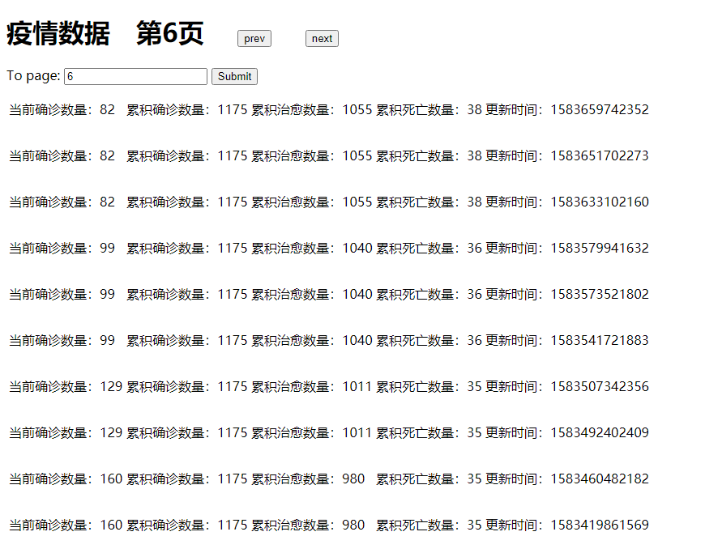
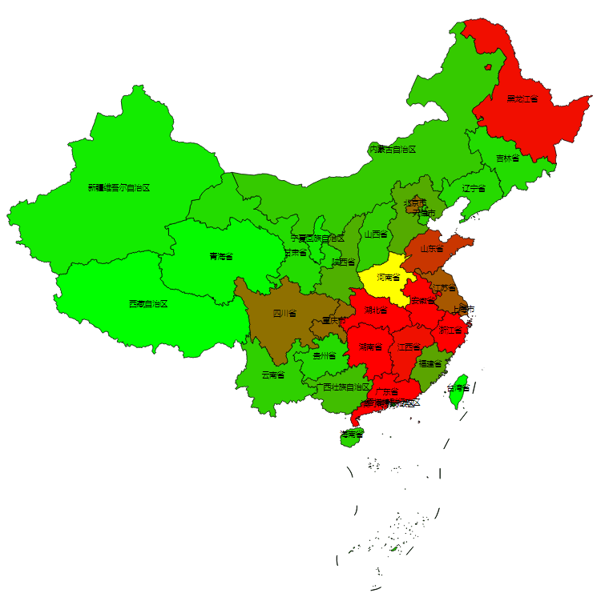
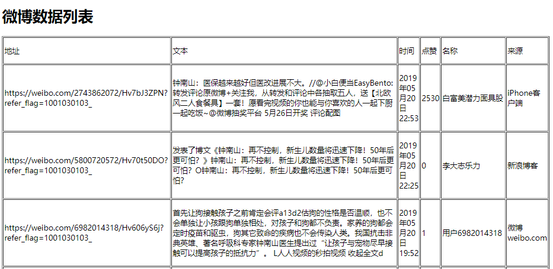

# dxy-django

基于django的疫情数据&微博数据可视化

## Installation

```
$ git clone https://github.com/gochri/dxy-django
$ sudo pip3 install -r requirements.txt
$ cd socialmediaanalytics
```

##  Run

```
$ python manage.py runserver
```

* 疫情数据列表&分页展示 http://localhost:8000/sentimentanalysis/DXYAnalytics/

  <p align="center"></p>

* 疫情数据可视化 http://localhost:8000/sentimentanalysis/D3Analytics/

  <p align="center"></p>

* 微博数据列表 http://localhost:8000/weiboAnalytics/weiboList/

  <p align="center"></p>

* 微博词云图 http://localhost:8000/weiboAnalytics/weiboPic/

  <p align="center"></p>

* Kmeans聚类下的微博词云图 http://localhost:8000/weiboAnalytics/weiboKmeans/

  <p align="left"></p>

* 管理员 http://localhost:8000/admin/login/?next=/admin/ admin/gochri

